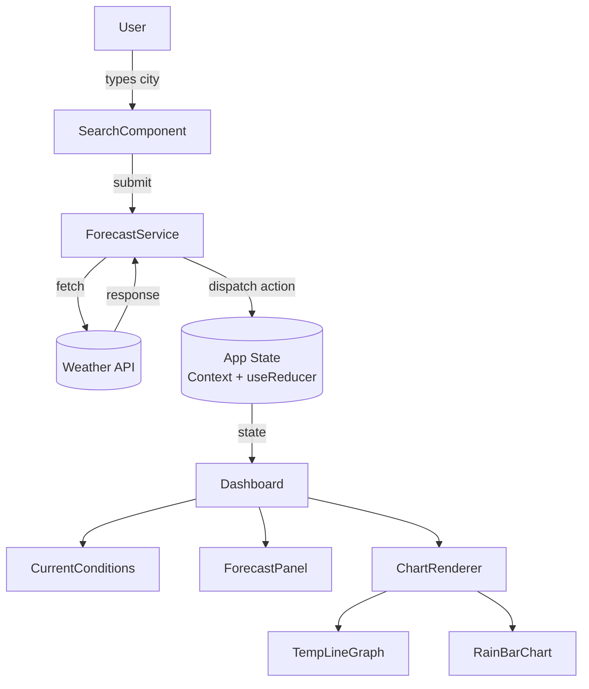

# Design Document: Weather Dashboard (Strom Aura)

## Overview

Strom Aura is a client-side weather dashboard that lets users search for any city and view a comprehensive weather snapshot: current conditions, key metrics (temperature, humidity, wind), a 7-day forecast panel, and two interactive charts (temperature line graph and rain probability bar chart).

The application is a single-page app (SPA) built with a component-based frontend framework (React). Weather data is fetched from an external Weather API. All data refresh logic runs in the browser; there is no custom backend server.

Key design decisions:
- **React + TypeScript** for type-safe component development
- **Recharts** for the temperature line graph and rain probability bar chart (lightweight, composable, React-native)
- **OpenWeatherMap API** (or compatible) as the Weather_API — provides current conditions and 7-day forecast in a single call
- **React Context + useReducer** for global state (selected city, unit preference, weather data, error states)
- **setInterval** for periodic refresh, cleared on component unmount

---

## Architecture



Data flow is unidirectional: user interactions trigger service calls, service calls dispatch state updates, state updates re-render components.

---

## Components and Interfaces

### SearchComponent

Renders a text input and handles city search submission and autocomplete display.

```ts
interface SearchComponentProps {
  onCitySelect: (city: CityResult) => void;
}

interface CityResult {
  id: string;
  name: string;
  country: string;
  lat: number;
  lon: number;
}
```

Behavior:
- Renders a text `<input>` for city name entry
- On submit, calls `ForecastService.searchCities(query)`
- If multiple results returned, renders a dropdown list of `CityResult` items
- On selection, calls `onCitySelect(city)` and closes the dropdown
- Displays "City not found" inline error when results are empty
- Displays "Connection error" when the API is unreachable

### ForecastService

A pure service module (not a React component) responsible for all Weather API communication.

```ts
interface ForecastService {
  searchCities(query: string): Promise<CityResult[]>;
  fetchWeatherData(city: CityResult, unit: TemperatureUnit): Promise<WeatherData>;
}

type TemperatureUnit = 'celsius' | 'fahrenheit';
```

- `searchCities` calls the geocoding endpoint and returns matching cities
- `fetchWeatherData` calls the current + forecast endpoint and returns a `WeatherData` object
- On network failure, throws a typed `ApiError` with `type: 'connection'`

### Dashboard

The root layout component. Subscribes to app state and orchestrates child components.

```ts
interface DashboardProps {
  // no external props — reads from AppContext
}
```

Manages two `setInterval` timers:
- Every 10 minutes: re-fetch current conditions
- Every 60 minutes: re-fetch 7-day forecast

Both intervals are cleared on unmount.

### CurrentConditions

Displays temperature, condition label + icon, humidity, and wind speed/direction.

```ts
interface CurrentConditionsProps {
  data: CurrentWeather;
  unit: TemperatureUnit;
}
```

### ForecastPanel

Renders the 7-day forecast as a row of day cards.

```ts
interface ForecastPanelProps {
  days: ForecastDay[];
  unit: TemperatureUnit;
  isPartial: boolean; // true when fewer than 7 days returned
}
```

### ChartRenderer

Hosts both charts side by side (or stacked on mobile).

```ts
interface ChartRendererProps {
  days: ForecastDay[];
  unit: TemperatureUnit;
}
```

Internally renders `TempLineGraph` and `RainBarChart`.

### TempLineGraph

Recharts `LineChart` with two `Line` series (high/low).

### RainBarChart

Recharts `BarChart` with a single `Bar` series using a custom cell color derived from rain probability.

---

## Data Models

```ts
interface WeatherData {
  city: CityResult;
  current: CurrentWeather;
  forecast: ForecastDay[];
  fetchedAt: number; // Unix timestamp ms
}

interface CurrentWeather {
  temperatureCelsius: number;
  conditionLabel: string;       // e.g. "Sunny", "Cloudy"
  conditionIconCode: string;    // maps to icon asset
  humidityPercent: number;      // 0–100
  windSpeedKph: number;
  windDirection: string;        // e.g. "NW", "SE"
}

interface ForecastDay {
  date: string;                 // ISO date string "YYYY-MM-DD"
  dayLabel: string;             // e.g. "Mon", "Tue"
  conditionLabel: string;
  conditionIconCode: string;
  highTempCelsius: number;
  lowTempCelsius: number;
  rainProbabilityPercent: number; // 0–100
}

type TemperatureUnit = 'celsius' | 'fahrenheit';

// Utility
function celsiusToFahrenheit(c: number): number {
  return (c * 9) / 5 + 32;
}

// App State
interface AppState {
  selectedCity: CityResult | null;
  weatherData: WeatherData | null;
  unit: TemperatureUnit;
  isLoading: boolean;
  error: AppError | null;
}

type AppError =
  | { type: 'city_not_found' }
  | { type: 'connection'; previousData: WeatherData | null }
  | { type: 'invalid_data'; field: string };
```

---

## Correctness Properties

*A property is a characteristic or behavior that should hold true across all valid executions of a system — essentially, a formal statement about what the system should do. Properties serve as the bridge between human-readable specifications and machine-verifiable correctness guarantees.*

### Property 1: City search queries the API with the submitted name

*For any* non-empty city name string submitted to the SearchComponent, the ForecastService shall invoke the Weather API with that exact city name as the query parameter.

**Validates: Requirements 1.2**

### Property 2: All returned city options are displayed

*For any* list of CityResult objects returned by the API, the SearchComponent shall render exactly that many selectable options in the dropdown.

**Validates: Requirements 1.3**

### Property 3: City selection updates displayed weather data

*For any* CityResult selected by the user, the Dashboard shall display weather data whose `city.id` matches the selected city's `id`.

**Validates: Requirements 1.4, 2.1, 3.1, 4.1, 5.1**

### Property 4: API failure retains previous data

*For any* previously loaded WeatherData, if a subsequent API call throws a connection error, the AppState shall still contain the previous WeatherData and the error type shall be `'connection'`.

**Validates: Requirements 1.6**

### Property 5: Celsius-to-Fahrenheit conversion is correct

*For any* temperature value in Celsius, the displayed Fahrenheit value shall equal `(celsius * 9/5) + 32`, rounded to the same precision.

**Validates: Requirements 2.3**

### Property 6: Out-of-range humidity values are discarded

*For any* humidity value returned by the API that is less than 0 or greater than 100, the ForecastService shall not store it in `CurrentWeather.humidityPercent` and the Dashboard shall display a data unavailable indicator instead.

**Validates: Requirements 4.3**

### Property 7: Forecast day cards contain all required fields

*For any* ForecastDay object, the rendered day card shall contain the date label, condition icon, high temperature, low temperature, and rain probability percentage.

**Validates: Requirements 6.3**

### Property 8: Partial forecast shows available days and unavailability indicator

*For any* forecast response containing between 1 and 6 days (inclusive), the ForecastPanel shall render exactly that many day cards and display an indicator that full forecast data is unavailable.

**Validates: Requirements 6.4**

### Property 9: Charts render one data point per forecast day

*For any* forecast containing N days (1 ≤ N ≤ 7), the TempLineGraph shall contain exactly N data points on each series (high and low), and the RainBarChart shall contain exactly N bars.

**Validates: Requirements 7.1, 8.1**

### Property 10: Chart axis labels match forecast days and selected unit

*For any* forecast data and temperature unit preference, the x-axis labels of both charts shall match the `dayLabel` values of the forecast days in order, and the y-axis of the TempLineGraph shall reflect the selected unit (°C or °F).

**Validates: Requirements 7.2, 8.2**

### Property 11: Tooltip content contains exact value and date

*For any* data point on the TempLineGraph or bar on the RainBarChart, the tooltip displayed on hover shall contain the exact numeric value and the corresponding date string for that point.

**Validates: Requirements 7.4, 8.4**

### Property 12: Rain probability color gradient maps value to color

*For any* RainProbabilityPercent value p in [0, 100], the bar color shall be a deterministic function of p such that higher values produce a color closer to the high-probability end of the gradient.

**Validates: Requirements 8.3**

### Property 13: Charts re-render when forecast data changes

*For any* new ForecastDay array dispatched to AppState, the TempLineGraph and RainBarChart shall reflect the new data values after the next render cycle.

**Validates: Requirements 7.5, 8.5**

---

## Error Handling

| Scenario | Behavior |
|---|---|
| City not found (empty API results) | SearchComponent shows "City not found" inline error; no state change |
| API unreachable / network error | ForecastService dispatches `{ type: 'connection' }` error; Dashboard shows banner; previous WeatherData retained |
| Humidity out of range (< 0 or > 100) | ForecastService discards value; CurrentConditions shows "—" or "N/A" |
| Fewer than 7 forecast days returned | ForecastPanel renders available days; shows partial data warning |
| Chart rendered with empty data | ChartRenderer renders empty state placeholder instead of chart |

All errors are stored in `AppState.error` and cleared on the next successful data fetch.

---

## Testing Strategy

### Dual Testing Approach

Both unit tests and property-based tests are required. They are complementary:
- Unit tests catch concrete bugs with specific inputs and verify integration points
- Property-based tests verify universal correctness across the full input space

### Unit Tests

Focus areas:
- `ForecastService`: mock API responses, verify correct parsing into `WeatherData`
- `SearchComponent`: render with mock results, verify dropdown items, error messages
- `CurrentConditions`: render with known data, verify correct unit display
- `ForecastPanel`: render with 7 days, render with partial data (e.g. 4 days)
- `ChartRenderer`: render with known forecast, verify axis labels and series count
- Refresh timers: use fake timers to verify 10-min and 60-min intervals fire correctly

### Property-Based Tests

Library: **fast-check** (TypeScript-native, works with Jest/Vitest)

Configuration: minimum **100 iterations** per property test.

Each property test must include a comment tag in the format:
`// Feature: weather-dashboard, Property N: <property_text>`

| Property | Test Description |
|---|---|
| P1 | Arbitrary city name string → API called with that string |
| P2 | Arbitrary CityResult[] → dropdown renders same count |
| P3 | Arbitrary CityResult → displayed data city.id matches |
| P4 | Arbitrary WeatherData + simulated failure → previous data retained |
| P5 | Arbitrary Celsius float → Fahrenheit display equals formula |
| P6 | Arbitrary out-of-range humidity → discarded, N/A shown |
| P7 | Arbitrary ForecastDay → rendered card contains all 5 fields |
| P8 | Arbitrary partial forecast (1–6 days) → correct count + warning |
| P9 | Arbitrary N-day forecast → charts have exactly N points/bars |
| P10 | Arbitrary forecast + unit → axis labels match day labels and unit |
| P11 | Arbitrary data point → tooltip contains value and date |
| P12 | Arbitrary p in [0,100] → bar color is monotone in p |
| P13 | Arbitrary new ForecastDay[] → chart data matches new array |

### Test File Structure

```
src/
  __tests__/
    unit/
      ForecastService.test.ts
      SearchComponent.test.tsx
      CurrentConditions.test.tsx
      ForecastPanel.test.tsx
      ChartRenderer.test.tsx
    property/
      citySearch.property.test.ts
      temperatureConversion.property.test.ts
      humidityValidation.property.test.ts
      forecastDisplay.property.test.ts
      chartRendering.property.test.ts
```
